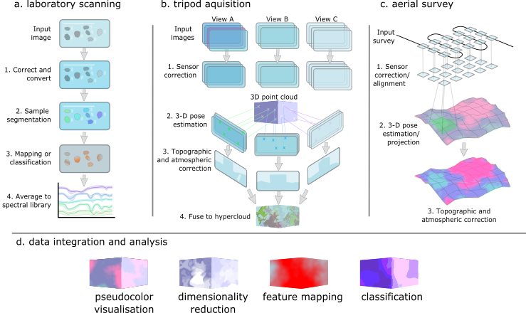
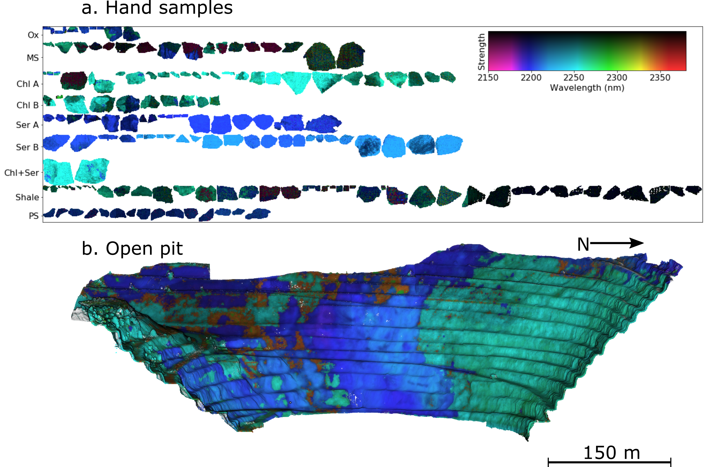

<h1>
  
  <span>hylite</span>
</h1>


*hylite* is an open-source python package for loading and preprocessing imagery from a variety of hyperspectral sensors, applying various analyses (e.g., multi-feature minimum wavelength maps, dimensionality reduction, band ratios), and/or fusing HSI imagery with high-resolution point-cloud data to generate seamless and radiometrically corrected hyperclouds. Reference spectra from spectral libraries, ground or laboratory measurements can also be integrated and used to perform supervised classifications using machine learning techniques.

--------

#### Tutorial:

Try *hylite* [here](https://drive.google.com/drive/folders/1hkr4gtP1OY_PIK7cynl3dWd3sYi_9s5F?usp=drive_link)!

And, for EO (satellite hyperspectral) applications, then please also see [this](https://drive.google.com/drive/folders/1_QLu8OsT8hfcLZ3nLqtwO1bLbJIauICb) set of tutorials.

#### Documentation:

Detailed documentation for *hylite* can be found at: https://hifexplo.github.io/hylite/hylite.html.

#### User interface:

We are currently developing a user interface for some *hylite* tools using [napari](https://napari.org/stable/). Still lots to do, but this can be found here: https://github.com/samthiele/napari-hippo. 

--------

A key design feature of *hylite* is polymorphism between different spectral data types, such that spectral libraries,
images and point clouds can be easily analysed and integrated. Pre-processing workflows for each of these
data types have also been implemented.

*hylite* also includes a variety of tools for visualising different hyperspectral datasets and associated derivatives. For
example, minimum wavelength maps can be easily calculated and visualised for spectral libraries, laboratory scans and
outdoor scenes.

------




*Preprocessing and correction workflows implemented in hylite for different data types.*

-----------




*Example visualisations of minimum wavelength maps calculated for (a) imagery of rock samples acquired using a core-scanner
and (b) a hypercloud of an open-pit mine.*

----------


Release notes
--------------

#### Version 1.4

New features:
* Added `hylite.analyse.fourier` for fourier-based compression, maxima and minima identification and derived querying/searching of spectral libraries.
* `HyData`, `HyImage`, `HyCloud`, and `HyLibrary` support `[]` indexing: string keys access ENVI/header fields; floats and band names on the band axis select wavelengths via `get_band_index()` (e.g. `image[..., 680.0]`, `image['Band 1':'Band 5']`).
* `hylite.transform.sample.Resample` for binning hyperspectral data onto satellite or other sensor bandpasses (`ASTER`, `SENTINEL`, or custom intervals).

Significant spring cleaning to remove little-used code:
* Removed `hylite.analyse.supervised` and `hylite.analyse.unsupervised` as these functions are now superceeded by [hklearn](https://github.com/samthiele/hklearn/).
* Removed `hylite.filter.TPT` as similar analyses can now be done much better using `hylite.analyse.fourier`.
* Removed `hylite.filter.segment` as functions there are largely redundant / unused (superceeded by e.g., `hycore`).
* Deprecated `hylite.filter` (legacy PCA/MNF only); prefer `hylite.transform.reduction` for dimensionality reduction and `hylite.transform.overlay` for multi-image fusion (replaces `filter.combine`).
* sklearn-dependent `PCA`, `MNF`, and `NoiseWhitener` moved to `hylite.transform.reduction`; other `hylite.transform` functions no longer require scikit-learn at import.

* Refactored tests to match hylite module structure

#### Version 1.3

New features:
* New `hylite.transform` submodule with scikit-learn based `PCA`, `MNF` and `NoiseWhitener` classes. These replace the legacy dimensionality reduction functions (although these are currently retained for compatability).
* Spectral unmixing functions (`mix`, `unmix`, `endmembers`) added to `hylite.analyse.unmixing`.
* Quick empirical line calibration via `hylite.illumination.autoELC` for fast relative reflectance correction. This should be USED WITH CARE, as it assumes
that the brightest pixel in a scene is from the white panel, but can be useful for rapid/real-time processing.
* Added Kubelka–Munk pseudo-absorbance conversion via `hylite.transform.convertToAbsorbance` [thanks Andrea / Tasnim!].
* Georeferencing-aware `crop`, `tile` and `mosaic` functions on `HyImage`, plus `resize` and `drop_bbl`.
* Interactive point cloud masking and spectral plotting from rendered views (`HyCloud.mask`, `plot_from_render`) [thanks Sandra!].
* Added initial Telops Hypercam Nano sensor preprocessing (`hylite.sensors.TelopsNano`). Use with care (could be more robust).
* Added numpy-based ENVI read/write and automatic wavelength unit conversion (including wavenumbers) in `io.load`.
* Lossy data compression via `HyData.getQuantized` / `fromQuanta`. Can be useful for running expensive algorithms over large numbers of pixels, as it 
  reduces as hyperspectral image to a classification and corresponding (comparatively small) spectral library. USE WITH CARE as the averaging associated
  with the classification can group spectra from different materials.
* Added faster `poly` and `quad` interpolation options for minimum wavelength mapping. `gauss` still produces the best results, but is an order-of-magnitude slower.

Improvements:
* Many bugfixes to scene blending (`blend_scenes`), projection maps and ENVI I/O (header bytes, interleave format, non-unix paths)
* `SAM` now works directly with `HyLibrary` instances.
* Image combination function moved to `hylite.transform.overlay` (formerly `hylite.filter.combine`), with optional optical-flow coregistration.
* `HyCollection` supports dictionary-like indexing and JSON serialisation of attributes.
* Expanded test coverage across transforms, unmixing, corrections and image tiling.

#### Version 1.2

New features:
* projection of push-broom data using `hylite.project.Pushbroom`
* `HyCollection` class for easily loading / saving large numbers of data files 
* Completely rewritten `HyLibrary` class for easily merging, resampling and splitting spectral libraries
* Added `align_to_cloud_manual` function for locating cameras with manually chosen tiepoints

Improvements:
* Completely re-written minimum wavelength mapping code for improved performance (thanks Numba!)
* Simplified structure for topographic and atmospheric corrections for cleaner code and increased flexibility
* Many improvements to plotting functions
* Greatly simplified input output code by wrapping specific funtions in generic `io.load` and `io.save`
* Removed GDAL as a required dependency (SPy will be used instead if GDAl can't be found). Note that SPy can have 
  unpredictable behaviour for non-reflectance files (outside of 0 - 1 range), so it is worth installing GDAL if you can
* Increased performance of `get_hull_corrected` and `rasterize` functions using Numba
* Significantly expanded penetration of test functions (though more work is needed here still)

Installation
--------------

1. Create and activate a new python environment (anacona users only)

```
conda create -n hylite
conda activate hylite
````

------------

2 Install *hylite* with pip.

`pip install hylite`


Installation (from GitHub)
--------------

1. Create and activate a new python environment (anacona users only)

```
conda create -n hylite
conda activate hylite
````

2. Download and unzip hylite from GitHub (or clone it using `git clone https://github.com/samthiele/hylite.git`)

3. Navigate into the hylite directory using terminal and install it using pip:

`pip install .`


Optional dependencies:
------------

A variety of other python packages might be needed depending on how you use _hylite_. These include:
 - _GDAL_: needed if working with georeferenced images (e.g. geotiffs, some envi files).
 - _jupyter_: recommended as coding interface when using hylite for exploratory data analysis.


Testing installation
----------------------

Check *hylite* is installed by opening a python console and running:

```python
import hylite
```

A better test of the installation can be performed by downloading the test data included in this repository, launching python or a jupyter notebook
and running the following code:

```python

import hylite
from hylite import io

lib = io.load( 'test_data/library.csv' )
lib.quick_plot()

image = io.load( 'test_data/image.hdr' )
image.quick_plot(hylite.RGB)

cloud = io.load( 'test_data/hypercloud.ply' )
cloud.quick_plot(cloud.header.get_camera(0), hylite.RGB)
```

Other test functionality is included in the _tests_ directory.

Next steps
-------------

1. Download and try the example notebooks / tutorials [here](https://drive.google.com/drive/folders/1hkr4gtP1OY_PIK7cynl3dWd3sYi_9s5F?usp=drive_link).
2. Find and adapt the one closest to what you need.
3. Happy processing! :D

Citing *hylite*
---------------

If you use *hylite* for your work then please cite:


```
Thiele, S. T., Lorenz, S., et al., (2021). Multi-scale, multi-sensor data
integration for automated 3-D geological mapping. Ore Geology Reviews. DOI: j.oregeorev.2021.104252
```
https://doi.org/10.1016/j.oregeorev.2021.104252

For the illumination correction methods, please see:
```
Thiele, S. T., Lorenz S., Kirsch, M., Gloaguen, R., (2021). A novel and open-source illumination correction 
for hyperspectral digital outcrop models. Transactions on Geoscience and Remote Sensing. DOI: 10.1109/TGRS.2021.3098725
```
https://doi.org/10.1109/TGRS.2021.3098725

And for details related to projection and correction of pushbroom UAV hyperspectral data please see:

```
Thiele, S. T., Bnoulkacem, Z., Lorenz, S., Bordenave, A., Menegoni, N., Madriz, Y., ... & Kenter, J. (2022). 
Mineralogical Mapping with Accurately Corrected Shortwave Infrared Hyperspectral Data Acquired Obliquely from UAVs. 
Remote Sensing, 14(1), 5. DOI: 10.3390/rs14010005
```
https://doi.org/10.3390/rs14010005


Contributing to  hylite
-------------------------

Cool additions are welcomed!
Please feel free to submit pull requests through GitHub or get in touch with us directly if
you have any questions. Bug reports are also welcomed (though do try to be specific).

---------------
