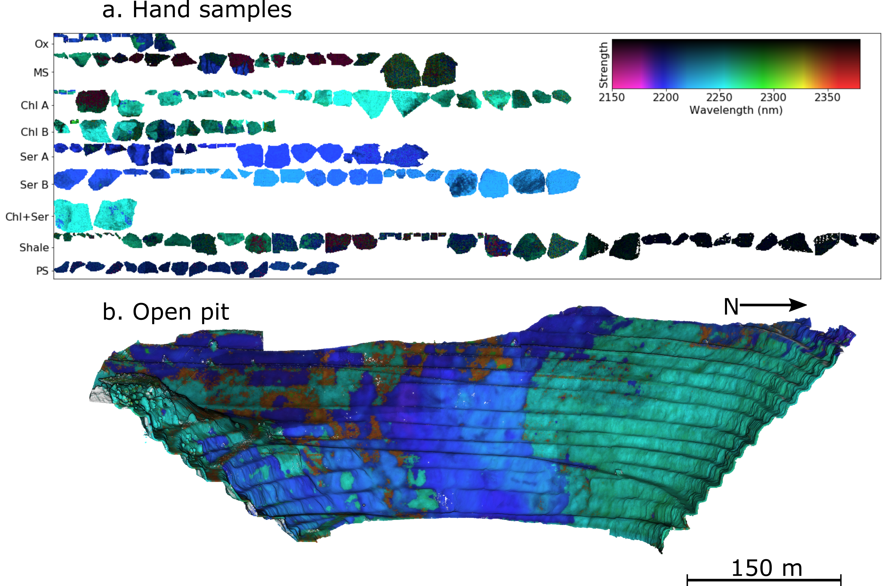

Overview
========================================================

*hylite* is an open-source python package for preprocessing imagery from a variety of hyperspectral sensors
and fusing the results with high-resolution point-cloud data to generate seamless and radiometrically corrected
hyperclouds.  A variety of analysis techniques are also implemented, including minimum wavelength mapping,
dimensionality reduction and spectral angle mapping. Reference spectra from spectral libraries, ground or laboratory measurements
can also be integrated and used to perform supervised classifications using machine learning techniques.

A key design feature of *hylite* is polymorphism between different spectral data types, such that spectral libraries,
images and point clouds can be easily analysed and integrated. Pre-processing workflows for each of these
data types have also been implemented.

*hylite* also includes a variety of tools for visualising different hyperspectral datasets and associated derivatives. For
example, minimum wavelength maps can be easily calculated and visualised for spectral libraries, laboratory scans and
outdoor scenes.

------

.. image:: workflow.png

*Preprocessing and correction workflows implemented in hylite for different data types.*

----------

*Example visualisations of minimum wavelength maps calculated for (a) imagery of rock samples acquired using a core-scanner
and (b) a hypercloud of an open-pit mine.*

----

Citing *hylite*
---------------

If you use *hylite* for your work then please cite:

*Thiele, S. T., Lorenz, S., et al., (2021). Multi-scale, multi-sensor data
integration for automated 3-D geological mapping using hylite. Ore Geology Reviews.*

Other papers of interest may include:

*Thiele, S. T., Lorenz, S., Kirsch, M., & Gloaguen, R. (2021). A Novel and Open-Source Illumination
Correction for Hyperspectral Digital Outcrop Models. IEEE Transactions on Geoscience and Remote Sensing.*

Contributing to  hylite
-------------------------

Cool additions are welcomed!
Please feel free to submit pull requests through GitHub or get in touch with us directly if
you have any questions. Bug reports are also welcomed (though please do try to be specific).

---------------

.. toctree::
   :maxdepth: 1

   installation
   quickstart
   examples
   hylite_data
   packages

---------------

+-----------------------+-----------------------+-----------------------+
|    :ref:`genindex`    |     :ref:`modindex`   |     :ref:`search`     |
+-----------------------+-----------------------+-----------------------+
