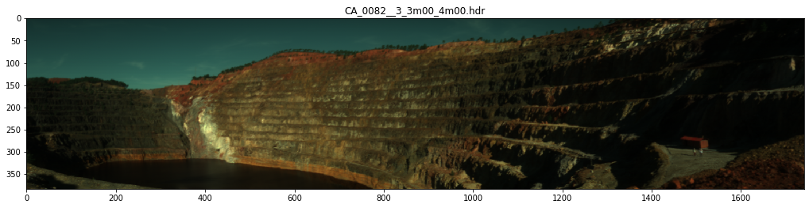
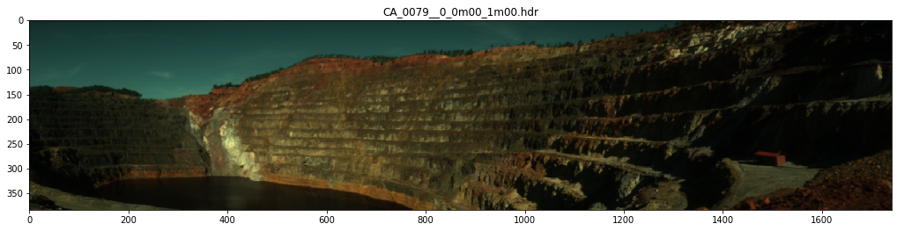
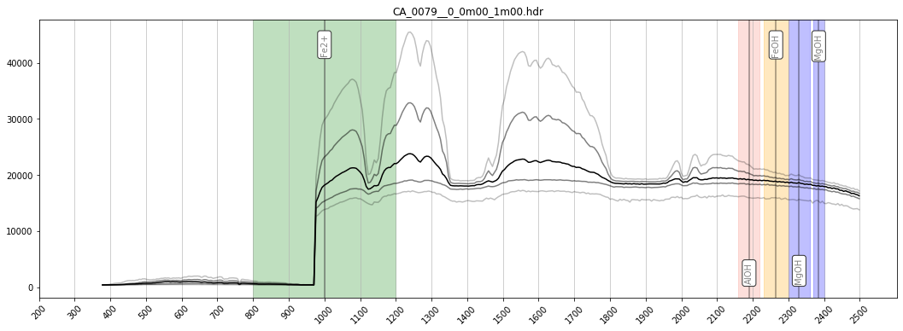

Load and plot
-------------

Find hyperspectral images in a directory, load them and plot previews.
Useful for quick data exploration and selection.

.. code:: python

    import os
    import glob

.. code:: python

    import hylite
    import hylite.io as io

Load images

.. code:: python

    # specify directory and find all .hdr files
    path = '/Users/thiele67/Documents/Data/CA/Terrestrial/2020'
    files = glob.glob( os.path.join(path,"**/*.hdr"), recursive=True )
    
    # load images, ignoring calibratons, dark references and white references
    images = []
    names = []
    paths = []
    for f in files:
        if 'calibration' in f or 'DARKREF'in f or 'WHITEREF' in f:
            continue
        try:
            images.append( io.loadWithGDAL(f) )
            paths.append(f)
            names.append( os.path.basename(f) )
        except:
            pass # ignore - this wasn't an image file

Plot

.. code:: python

    bands = hylite.RGB # try hylite.SWIR or hylite.BROAD for other visualisations
    band_range = (0,-1) # set to specific wavelengths to narrow spectra plots. E.g. for SWIR only: band_range=(2000.0,2400.0)
    for i,img in enumerate(images):
        
        # rotate image if need be
        if img.aspx() > 1.0: 
            img.rot90()
            img.flip('y')
        
        fig,ax = img.quick_plot( bands )
        ax.set_title(names[i])
        fig.show()
        
        fig,ax = img.plot_spectra()
        ax.set_title(names[i])
        fig.show()

Print paths for easy copying

.. code:: python

    for i, p in enumerate(paths):
        print(p)

.. parsed-literal::

    /Users/thiele67/Documents/Data/CA/Terrestrial/2020/CA_0082__3_3m00_4m00/capture/CA_0082__3_3m00_4m00.hdr
    /Users/thiele67/Documents/Data/CA/Terrestrial/2020/CA_0079__0_0m00_1m00/capture/CA_0079__0_0m00_1m00.hdr

