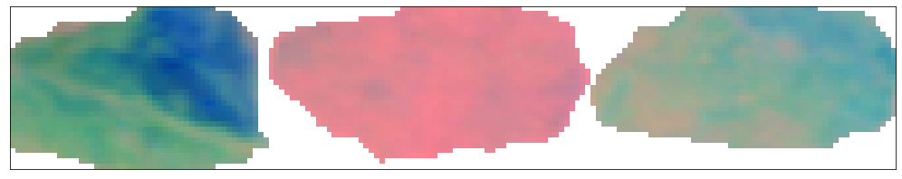
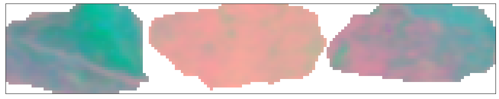

Minimum noise filter
====================

Apply a minimum noise filter (MNF) to a hyperspectral image. Note that a
more-or-less identical workflow could be applied to hypercloud (HyCloud)
data.

.. code:: python

    import sys, os
    import numpy as np
    import matplotlib.pyplot as plt
    
    import hylite
    from hylite import io
    from hylite.filter import MNF

Load image
~~~~~~~~~~

.. code:: python

    # load image
    image = io.load( '../demo_data/image.hdr')

.. code:: python

    # plot RGB preview
    fig,ax = image.quick_plot( hylite.RGB )
    ax.set_xticks([])
    ax.set_yticks([])
    ax.set_title("RGB Preview")
    fig.show()

.. image:: output_4_0.png

Calculate MNF
~~~~~~~~~~~~~

Apply a MNF to entire data cube:

.. code:: python

    mnf, weights = MNF( image )

.. code:: python

    fig,ax = mnf.quick_plot( (0,1,2) )
    ax.set_xticks( [] )
    ax.set_yticks( [] )
    fig.show()

Apply MNF to a subset of the data cube (SWIR bands only)

.. code:: python

    mnf, weights = MNF( image, band_range=(2000.,2380.) )

.. code:: python

    fig,ax = mnf.quick_plot( (0,1,2) )
    ax.set_xticks( [] )
    ax.set_yticks( [] )
    fig.show()

