Multi-feature MWL mapping
=========================================

*hylite* includes a powerful feature fitting technique that allows a
spectra to be broken into multiple potentially overlapping Gaussian or
Lorentzian features. The first half of this notebook shows this applied
to a spectral library, so that the results can be easily plotted and
checked. Then we apply multi-feature minimum wavelength mapping to a
hyperspectral image to distinguish different minerals.

.. code:: python

    import sys, os
    import numpy as np
    import matplotlib.pyplot as plt
    
    import hylite
    from hylite import io
    from hylite import HyFeature
    from hylite.correct import get_hull_corrected
    from hylite.analyse import minimum_wavelength, colourise_mwl, closestFeature, sortMultiMWL, getMixedFeature

Load spectral library
~~~~~~~~~~~~~~~~~~~~~

.. code:: python

    lib = io.loadLibraryCSV(r'../demo_data/library.csv')

Apply hull correction to region of interest

.. code:: python

    lib_hc = get_hull_corrected(lib, band_range=(2155.0,2340.0))

.. code:: python

    fig,ax = lib_hc.quick_plot(samples=['2016_AM-21','2016_EH-005','2016_AM-UNK','2019_RZI-003'],labels=[])
    ax.set_xlim(2155.0,2330.0)
    fig.show()

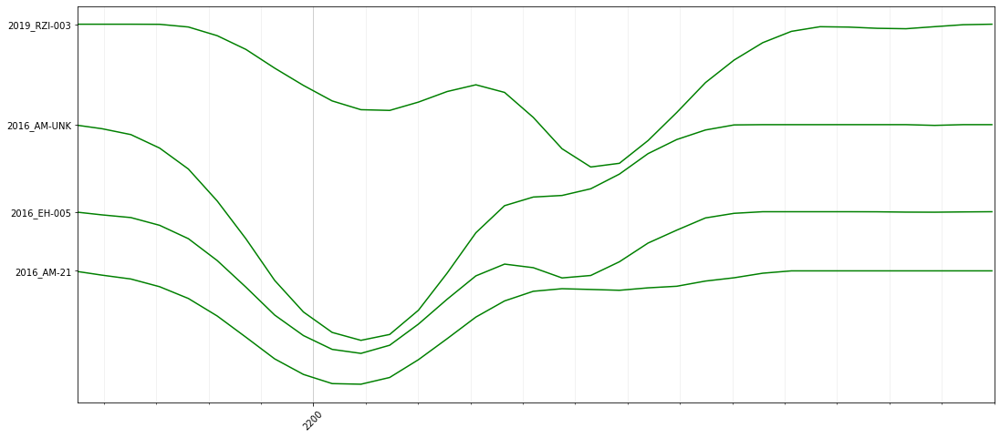

Extract spectra
~~~~~~~~~~~~~~~

Extract some of the spectra in the spectral library as numpy arrays

.. code:: python

    refl = lib_hc.get_sample_spectra('2019_RZI-003')
    wav = lib_hc.get_wavelengths()

Fit single features
~~~~~~~~~~~~~~~~~~~

Can you see why this is a bad idea?

.. code:: python

    fit = HyFeature.fit(wav, refl, method='gauss', n=1)
    fig,ax = fit.quick_plot()

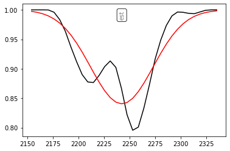

Fit multiple features
~~~~~~~~~~~~~~~~~~~~~

Problem solved?

.. code:: python

    fit = HyFeature.fit(wav, refl, method='gauss',n=3)
    fig,ax = fit.quick_plot( method='gauss', label=None )
    ax.set_title("Multi-gaussian fit")
    fig.show()
    
    fit = HyFeature.fit(wav, refl, method='lorentz',n=3)
    fig,ax = fit.quick_plot( method='lorentz' )
    ax.set_title("Multi-lorentzian fit")
    fig.show()

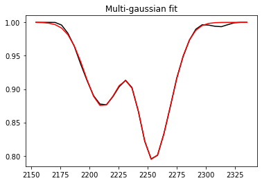

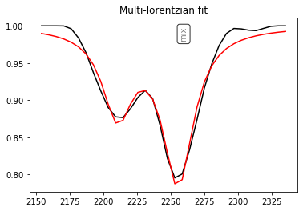

.. code:: python

    for n in ['2016_AM-21','2016_EH-005','2016_AM-UNK','2019_RZI-003']: # lib_hc.get_sample_names(): #
        
        refl = lib_hc.get_sample_spectra(n)
        wav = lib_hc.get_wavelengths()
        
        ftol = 1e-2
        fit_single = HyFeature.fit(wav,refl,method='gauss',n=1,ftol=ftol)
        fit_gauss = HyFeature.fit(wav, refl, method='gauss',n=3,ftol=ftol)
        fit_lorentz = HyFeature.fit(wav, refl, method='lorentz',n=3,ftol=ftol)
        
        fig,ax = plt.subplots(1,3,figsize=(18,2))
        for a,t,f in zip(ax,['Single','Lorentz','Gauss'],[fit_single,fit_lorentz,fit_gauss]):
            f.quick_plot(ax=a, alpha=0.9, label=None)
            if f.components is None:
                a.set_title("%s: %s (%d features)" % (n, t,1))
            else:
                a.set_title("%s: %s (%d features)" % (n, t,len(f.components)))
                colors=['orange','g','b','gray']
                for i,c in enumerate(f.components):
                    c.color = colors[i]
                    c.data = None
                    c.quick_plot( ax=a, alpha=0.5, linestyle='dotted', label=None )
                    a.plot( [c.pos, c.pos], [1.0, 1.0-c.depth], color=colors[i] )
                    
            #a.set_ylim(0.8,1.0)
            if not 'Single' in t:
                a.set_yticks([])
        fig.tight_layout()
        fig.show()

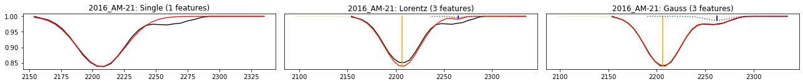

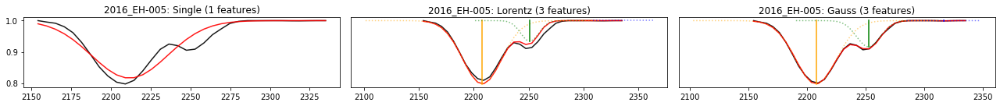

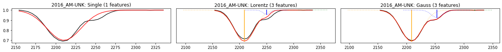

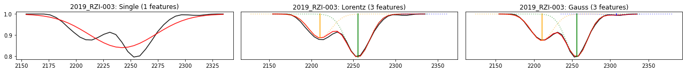

Use multi-feature technique for mwl mapping
~~~~~~~~~~~~~~~~~~~~~~~~~~~~~~~~~~~~~~~~~~~

Fit multiple gaussian features to the SWIR region of an hyperspectral
image of a rock sample.

.. code:: python

    # load image
    image = io.loadWithGDAL( '../demo_data/image.hdr')

.. code:: python

    # plot RGB preview
    fig,ax = image.quick_plot( hylite.RGB )
    ax.set_xticks([])
    ax.set_yticks([])
    ax.set_title("RGB Preview")
    fig.show()
    
    # plot spectral summary
    fig,ax = image.plot_spectra( band_range=(2000.,2400.))
    ax.set_xlim(2100,2400)
    ax.set_title("SWIR (percentile spectra)")
    fig.show()

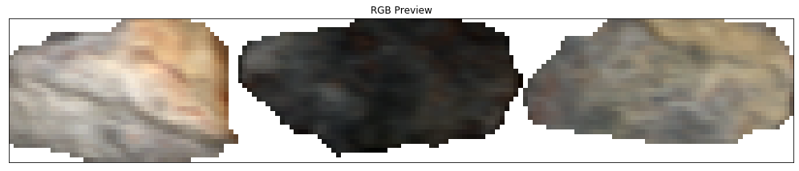

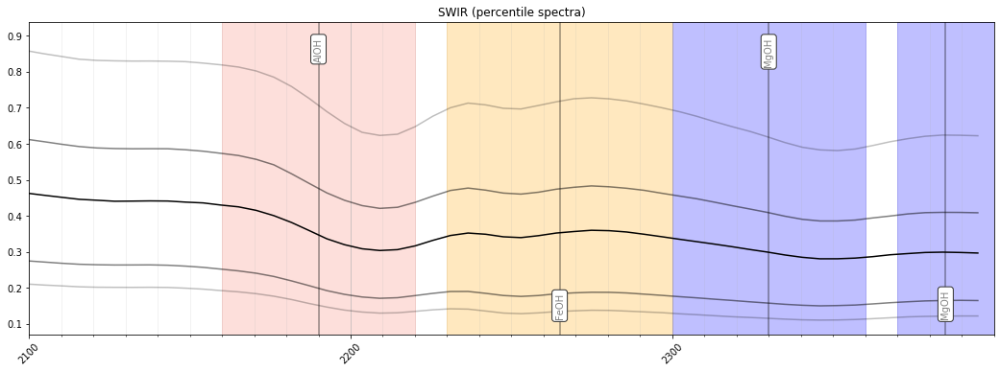

Calculate minimum wavelength map:

.. code:: python

    minw, maxw = 2140., 2400. # range to do mwl mapping over
    detrend = 'hull' # detrending method
    n = 3 # number of features to fit
    ftype = 'gauss' # 'gaussian' or 'lorentzian' feature
    threads = 1 # number of threads to distribute computation across (for large datasets)

.. code:: python

    mwl = minimum_wavelength( image, minw, maxw, method=ftype, trend=detrend, n=n, threads=threads, vb=True)

Visualise minimum wavelength maps
~~~~~~~~~~~~~~~~~~~~~~~~~~~~~~~~~

Sort features by depth and map to RGB

.. code:: python

    mwl = sortMultiMWL( mwl, 'depth' )
    rgb = [colourise_mwl(m,strength=True,hue_map='swir',depth_map=(0,0.15)) for m in mwl]

.. code:: python

    for _rgb, title in zip(rgb,["Primary", "Secondary", "Tertiary"]):
        fig, ax = _rgb[0].quick_plot((0,1,2), vmin=0, vmax=1)
        ax.set_xticks( [] )
        ax.set_yticks( [] )
        ax.set_title("%s feature" % title)
        
        # plot legend
        _rgb[1].plot(ax, pos=(1.05,0.5), s=(0.2,0.4))
        
        fig.show()

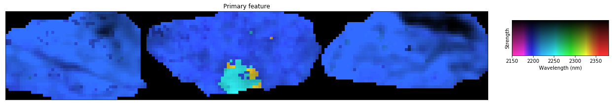

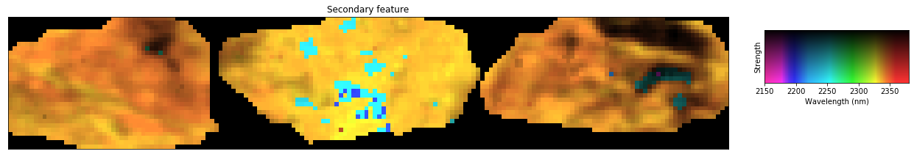

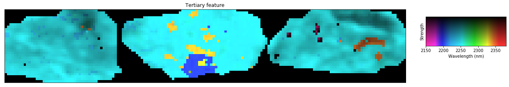

Extract and analyse specific features
~~~~~~~~~~~~~~~~~~~~~~~~~~~~~~~~~~~~~

Extract the AlOH feature (where it exists) and map its position:

.. code:: python

    F2200 = closestFeature( mwl, 2200., valid_range=(2100.,2230.), depth_cutoff=0.05 )

.. code:: python

    fig,ax = F2200.quick_plot( 0, cmap='coolwarm' ) # plot feature position
    fig.colorbar( ax.cbar )
    ax.set_xticks( [] )
    ax.set_yticks( [] )
    ax.set_title("AlOH feature position")
    fig.show()

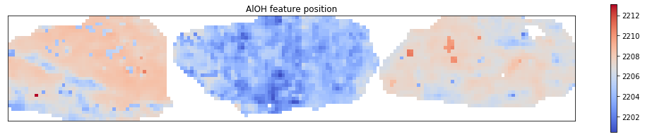

.. code:: python

    fig,ax = F2200.quick_plot( 2, cmap='coolwarm' ) # plot feature depth
    fig.colorbar( ax.cbar )
    ax.set_xticks( [] )
    ax.set_yticks( [] )
    ax.set_title("AlOH feature depth")
    fig.show()

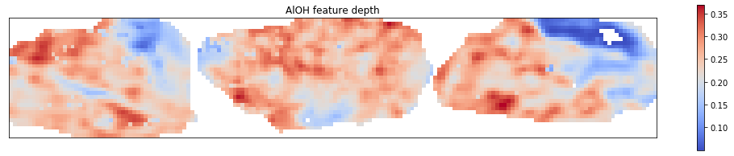

