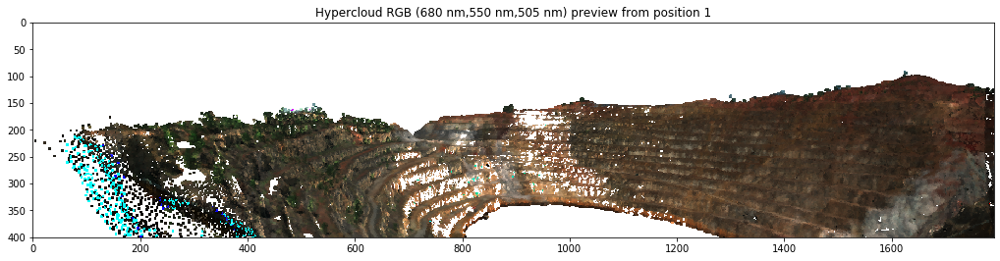
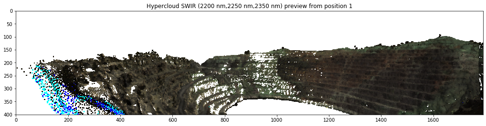
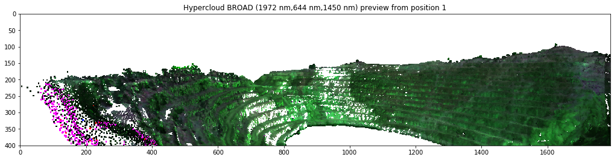
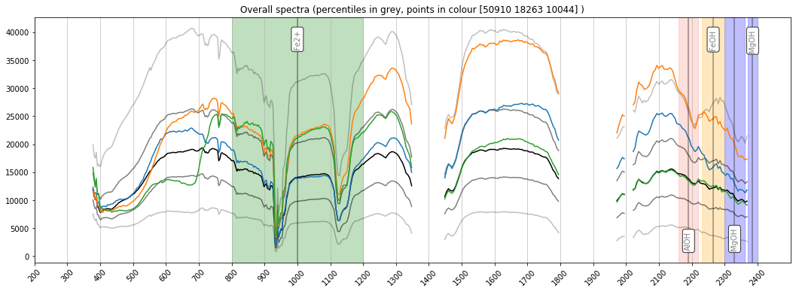
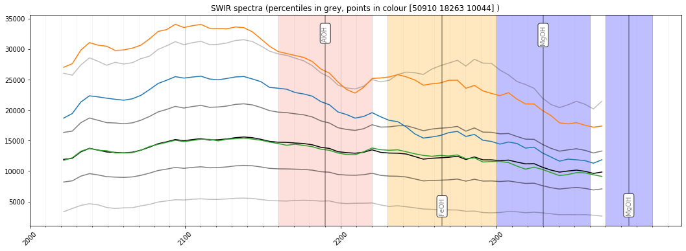
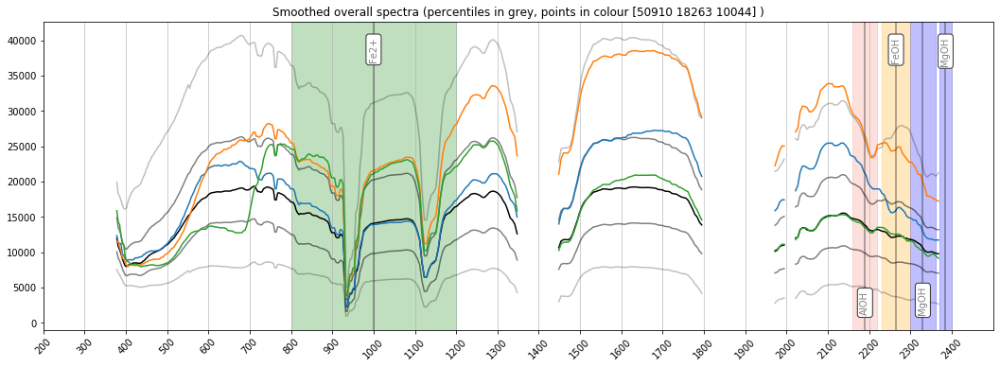
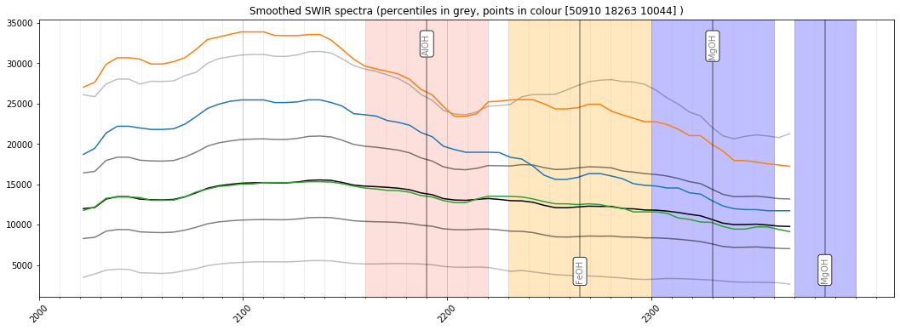
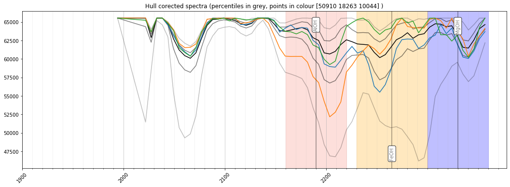

Filtering and QAQC
==================

This notebook is intended largely as a quality check for freshly minted
hyperclouds. It is also a good opportunity to smooth spectra to reduce
noise etc. before generating data products or interpretations. Finally,
hull corrected clouds can be generated as a final spectral cleaning
step.

.. code:: python

    import os
    import numpy as np
    import hylite
    import hylite.io as io
    from hylite.correct import get_hull_corrected

Load and plot hypercloud and spectra (QAQC)
~~~~~~~~~~~~~~~~~~~~~~~~~~~~~~~~~~~~~~~~~~~

.. code:: python

    cloud_path = '/Users/thiele67/Documents/Data/CA/hypercloud/CA_0082__3_3m00_4m00_radiance_non_uni_cc.ply'
    cloud = io.loadCloudPLY(cloud_path)

.. code:: python

    export_directory = '/Users/thiele67/Documents/Data/CA/hypercloud/'
    
    # settings for preview plots
    n = 1 # index of camera to use for plot.
    s = 2 # size of points (in pixels; must be integer)
    
    # smoothing settings
    method = 'median' # options are 'median' or 'savgol'
    window = 3 # the size of the smoothing window (in bands). Must be an integer.  
    
    # hull correction settings
    hull_correct = True # set to True to calculate and export hull corrected cloud also
    band_range= (2000.0,-1) # bands to include in the hull corrected cloud. (0,-1) includes all bands.

Generate preview images (QAQC: inspect these carefully! 🧐 )

.. code:: python

    # generate preview
    cam = cloud.header.get_camera(n)
    
    fig,ax = cloud.quick_plot(cam, hylite.RGB, s=s, fill_holes=True)
    ax.set_title("Hypercloud RGB (%d nm,%d nm,%d nm) preview from position %d" % (*hylite.RGB, n))
    fig.show()
    
    fig,ax = cloud.quick_plot(cam, hylite.SWIR, s=s, fill_holes=True)
    ax.set_title("Hypercloud SWIR (%d nm,%d nm,%d nm) preview from position %d" % (*hylite.SWIR, n))
    fig.show()
    
    fig,ax = cloud.quick_plot(cam, hylite.BROAD, s=s, fill_holes=True)
    ax.set_title("Hypercloud BROAD (%d nm,%d nm,%d nm) preview from position %d" % (*hylite.BROAD, n))
    fig.show()

Generate preview spectra (QAQC: inspect these carefully! 🧐 )

.. code:: python

    # choose some random points
    np.random.seed(42)
    idx = (np.random.rand(3) * cloud.point_count()).astype(np.uint16)
    fig,ax = cloud.plot_spectra( indices = idx)
    ax.set_title("Overall spectra (percentiles in grey, points in colour %s )" % idx)
    fig.show()
    
    if (np.min( cloud.get_wavelengths() ) < 2000.0 and np.max( cloud.get_wavelengths()) > 2400.0 ):
        fig,ax = cloud.plot_spectra( band_range = (2000.0, 2400.0), indices=idx )
        ax.set_title("SWIR spectra (percentiles in grey, points in colour %s )" % idx)
        fig.show()

Smooth spectra
~~~~~~~~~~~~~~

.. code:: python

    if method == None or method == '':
        print("Not applying smoothing to spectra")
    else:
        if 'sav' in method.lower():
            cloud.smooth_savgol( window ) # smooth using savgol filter
        elif 'med' in method.lower():
            cloud.smooth_median( window ) # smooth using median filter
        else:
            assert False, "'%s' is an unknown smoothing method" % method
    
        fig,ax = cloud.plot_spectra( indices = idx)
        ax.set_title("Smoothed overall spectra (percentiles in grey, points in colour %s )" % idx)
        fig.show()
    
        if (np.min( cloud.get_wavelengths() ) < 2000.0 and np.max( cloud.get_wavelengths()) > 2400.0 ):
            fig,ax = cloud.plot_spectra( band_range = (2000.0, 2400.0), indices=idx )
            ax.set_title("Smoothed SWIR spectra (percentiles in grey, points in colour %s )" % idx)
            fig.show()

Hull correct
~~~~~~~~~~~~

.. code:: python

    # delete bad bands (these interfere with the correction)
    cloud = cloud.export_bands( cloud.header.get_bbl() ) 
    
    # apply hull correction
    if hull_correct:
        cloud_hc = get_hull_corrected( cloud, band_range=band_range ) # apply hull correction. This can take time....
        
        fig,ax = cloud_hc.plot_spectra( band_range=band_range, indices = idx)
        ax.set_title("Hull corected spectra (percentiles in grey, points in colour %s )" % idx)
        fig.show()

Export filtered cloud
~~~~~~~~~~~~~~~~~~~~~

.. code:: python

    if not (method == '' or method == None):
        name = os.path.splitext(os.path.basename( cloud_path ))[0] + '_smth.ply'
        cloud.compress()
        io.saveCloudPLY( os.path.join(export_directory, name), cloud)
    
    if hull_correct:
        name = os.path.splitext(os.path.basename( cloud_path ))[0] + '_hc.ply'
        cloud_hc.compress()
        io.saveCloudPLY( os.path.join(export_directory, name), cloud_hc)

