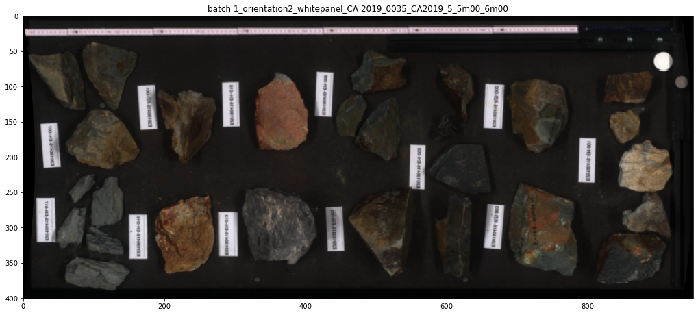
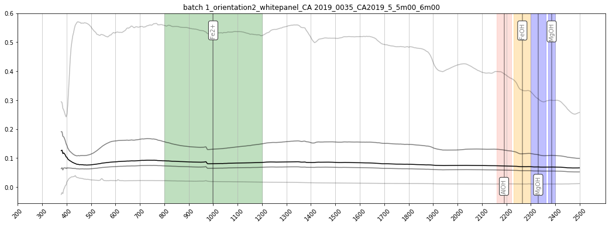

Sensor corrections and calibration
==================================

Apply sensor corrections to raw core-scan image and convert to radiance
using white and dark references.

.. code:: python

    import os
    import numpy as np
    import matplotlib.pyplot as plt

    import hylite
    import hylite.io as io
    from hylite.sensors import Fenix

Select images to process
------------------------

.. code:: python

    # link to folder containing Fenix data
    paths = [
        '/Users/thiele67/Documents/Data/CA/Scanner/white_panel/batch 1_orientation2_whitepanel_CA 2019_0035_CA2019_5_5m00_6m00',
        # add more files here if need be
    ]

.. code:: python

    # save reflectance files here
    outdir = '/Users/thiele67/Documents/Data/CA/Scanner/white panel/reflectance/'

Apply sensor corrections
------------------------

.. code:: python

    # chose the calibration target that was used to correct the data
    from hylite.reference.spectra import R90 as white #white panel
    from hylite.reference.spectra import R55_SiSu as grey # grey panel

    Fenix.set_white_ref_spectra( white ) # choose the panel that was used to aquire the scans

.. code:: python

    # apply sensor corrections to images
    images = [ Fenix.correct_folder( p,
                                    flip = True, # set flip to True if camera was mounted backwards (incorrect lens corr)
                                    shift = False, # set to true to correct for spatial shift between VNIR and SWIR
                                    verbose=True ) for p in paths ]

.. parsed-literal::

    Loading image /Users/thiele67/Documents/Data/CA/Scanner/white_panel/batch 1_orientation2_whitepanel_CA 2019_0035_CA2019_5_5m00_6m00/capture/CA 2019_0035_CA2019_5_5m00_6m00.hdr
    Converting to radiance... DONE.
    Filtering bad pixels... DONE.
    Applying lens correction... DONE.

.. code:: python

    # plot preview
    for i,image in enumerate(images):
        fig,ax = image.quick_plot( hylite.RGB )
        ax.set_title( os.path.basename( paths[i] ) )
        fig.show()

        fig, ax = image.plot_spectra()
        ax.set_title( os.path.basename( paths[i] ) )
        fig.show()

Save reflectance images
-----------------------

.. code:: python

    #specify output directory
    for i,image in enumerate(images):
        outpath = os.path.join(outdir, os.path.basename(paths[i])+"_refl.hdr")
        io.save(outpath, image)
