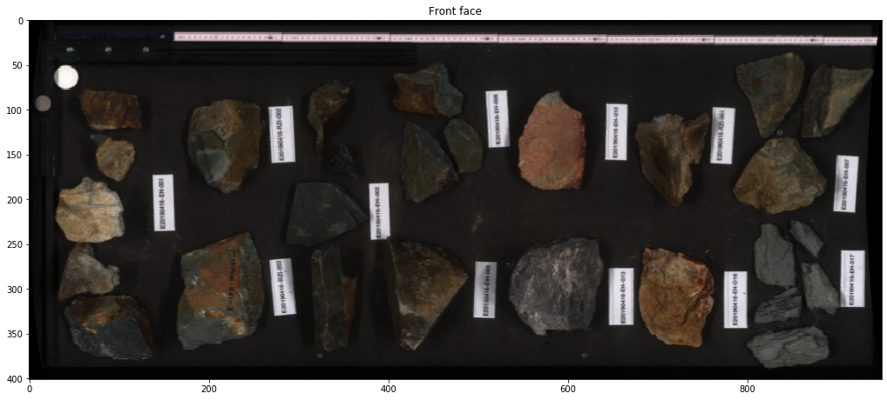
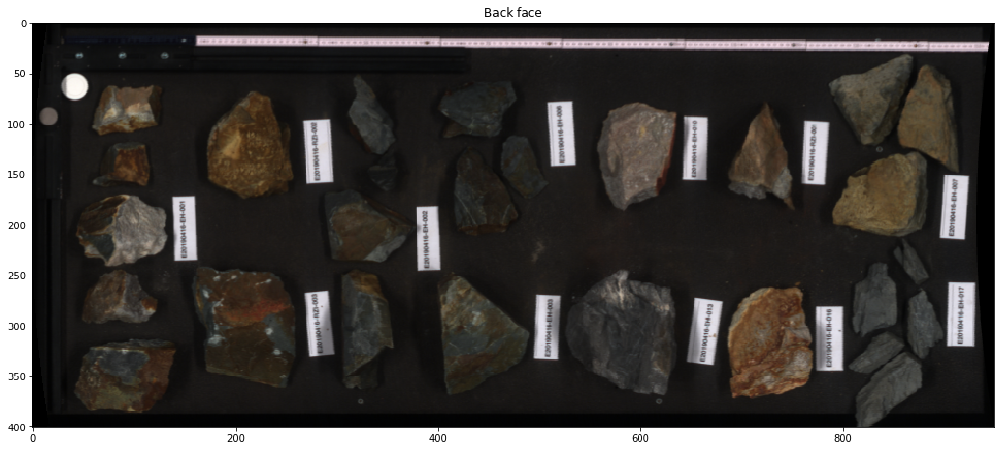
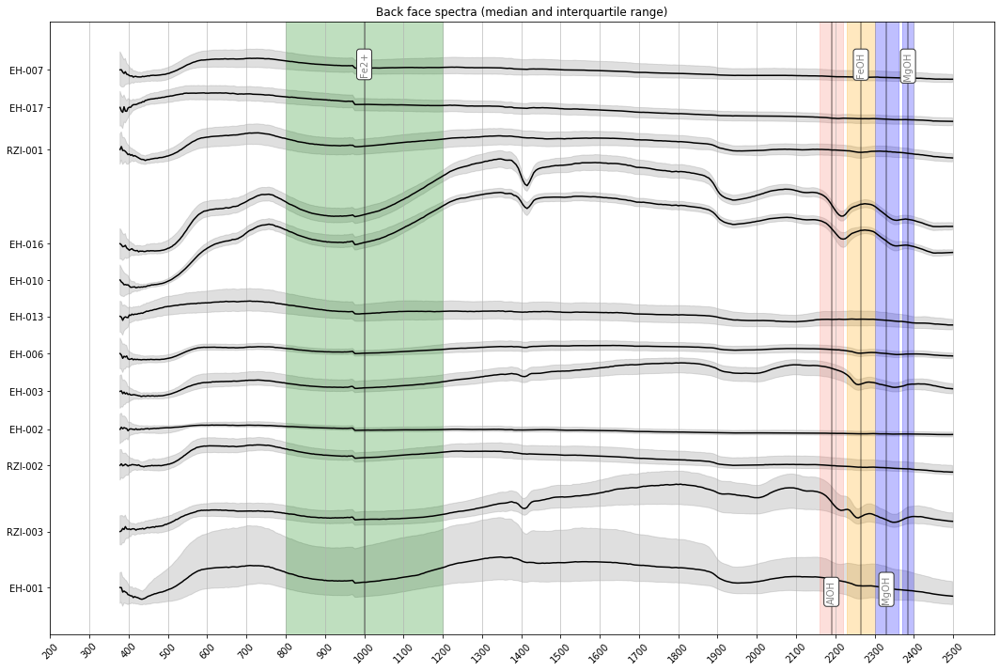
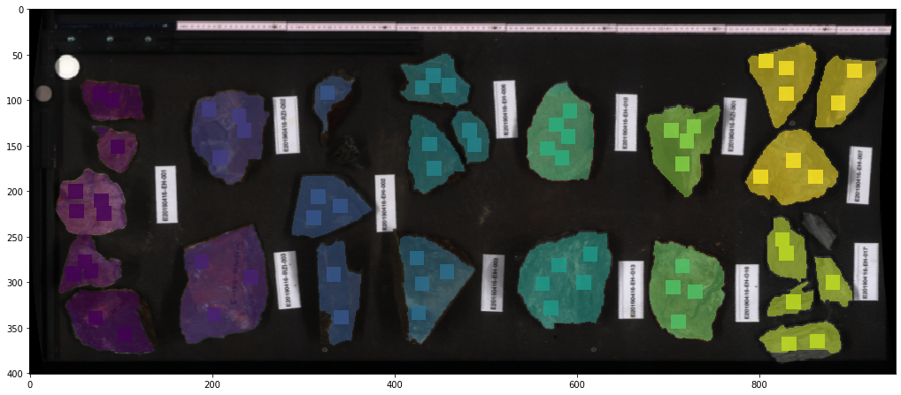
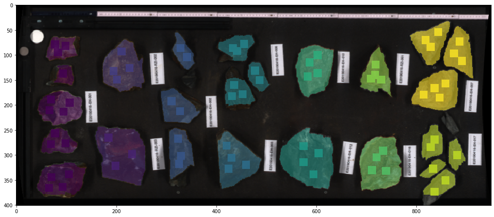
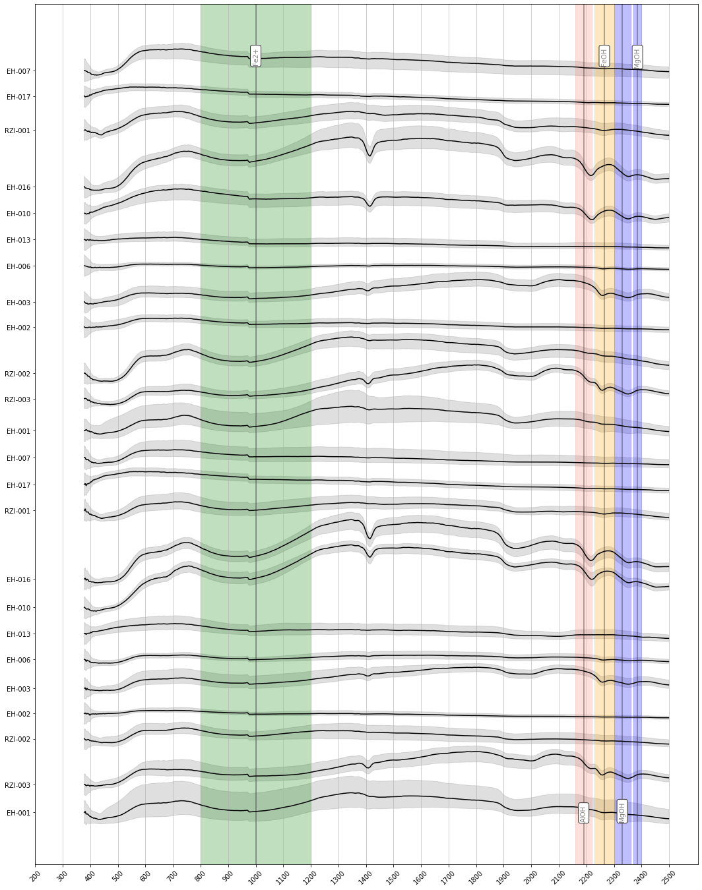

Segment foreground
==================

This notebook takes scans of block-samples and automatically or
semi-automatically segments individual samples to create a spectral
library.

.. code:: python

    import os
    import numpy as np
    import matplotlib as mpl
    import matplotlib.pyplot as plt
    import glob
    import cv2
    from matplotlib import path, patches
    
    import hylite
    import hylite.io as io
    from hylite.filter import label_blocks
    from hylite.analyse import getClassLibrary

Load radiance scans from directory

.. code:: python

    front_face = '/Users/thiele67/Documents/Data/CA/Scanner/white panel/reflectance/batch 1_orientation2_whitepanel_CA 2019_0035_CA2019_5_5m00_6m00.hdr'
    back_face = '/Users/thiele67/Documents/Data/CA/Scanner/white panel/reflectance/batch1_orientation1_whitepanel_CA 2019_0032_CA2019_2_2m00_3m00.hdr'
    
    front = io.load( front_face )
    fig,ax = front.quick_plot(hylite.RGB)
    ax.set_title("Front face")
    fig.show()
    
    if not back_face is None:
        back = io.load( back_face )
        fig,ax = back.quick_plot(hylite.RGB)
        ax.set_title("Back face")
        fig.show()
    else:
        back = None

Define sample numbers and front face/back face pairs
----------------------------------------------------

.. code:: python

    sample_IDs = ["EH-001",
                  "RZI-003",
                  "RZI-002",
                  "EH-002",
                  "EH-003",
                  "EH-006",
                  "EH-013",
                  "EH-010",
                  "EH-016",
                  "RZI-001",
                  "EH-017",
                  "EH-007"]

Extract point-spectra from samples for spectral library (and as seeds for segmentation).
---------------------------------------------------------------------------------------

Note that this requires matplotlib to work in interactive mode, which can cause issues on some environments.

.. code:: python

    fpoints = [] #frontface points per sample
    bpoints = [] #backface points per sample
    for s in sample_IDs:
        fpoints.append( front.pickPoints(title="Front face: %s" % s) )
        if back is not None:
            bpoints.append( back.pickPoints(title="Back face: %s" % s))
    %matplotlib inline

Add reference points into header

.. code:: python

    for image,points in [(front,fpoints),(back,bpoints)]:
        if not image is None:
            image.header['class names'] = sample_IDs # names of samples
            image.header['classes'] = len(sample_IDs) # number of samples
            for i,sample in enumerate(sample_IDs): # add sample points
                image.header['sample %s' % sample] = points[i]

.. code:: python

    io.saveHeader( io.matchHeader(front_face)[0], front.header)
    if back is not None:
        io.saveHeader( io.matchHeader(back_face)[0], back.header)

Plot sample spectra
~~~~~~~~~~~~~~~~~~~

.. code:: python

    library = front.getSpectralLibrary()
    fig,ax = library.quick_plot()
    ax.set_title("Front face spectra (median and interquartile range)")
    fig.show()
    
    if back is not None:
        library = front.getSpectralLibrary()
        fig,ax = library.quick_plot()
        ax.set_title("Back face spectra (median and interquartile range)")
        fig.show()

Attempt foreground/background segmentation using grab-cut
~~~~~~~~~~~~~~~~~~~~~~~~~~~~~~~~~~~~~~~~~~~~~~~~~~~~~~~~~

.. code:: python

    front_cls = label_blocks( front, boost=5, vb=True )
    if back is not None:
        back_cls = label_blocks( back, boost=5, vb=True )

Extract updated spectral library using whole sample blocks
~~~~~~~~~~~~~~~~~~~~~~~~~~~~~~~~~~~~~~~~~~~~~~~~~~~~~~~~~~

.. code:: python

    library = getClassLibrary( front, front_cls )
    if not back is None:
        library = library.merge( getClassLibrary( back, back_cls ) )
    fig,ax = library.quick_plot()
    fig.show()

Save classifications and library
~~~~~~~~~~~~~~~~~~~~~~~~~~~~~~~~~~~~~~~

.. code:: python

    # save classification
    front_face_cls = os.path.splitext(front_face)[0] + '_labels.cls.hdr'
    io.save( front_face_cls, front_cls)
    
    if back is not None:
        back_face_cls = os.path.splitext(back_face)[0] + '_labels.cls.hdr'
        io.save( back_face_cls, back_cls )

.. code:: python

    # save library
    io.save( '/Users/thiele67/Documents/Data/CA/Scanner/samples.csv', library )
