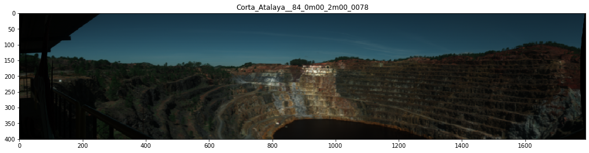

Sensor correction
=================

Load raw hyperspectral scenes and apply relevant sensor corrections.

.. code:: python

    import os
    import hylite

.. code:: python

    from hylite.sensors import Fenix # import sensor used to capture data here

Select images to process
------------------------

.. code:: python

    # link to folder containing Fenix data
    paths = [
        '/Users/thiele67/Documents/Data/CA/Terrestrial/2019/Corta_Atalaya__84_0m00_2m00_0078',
        # add more files here if need be
    ]

.. code:: python

    #specify output directory
    outdir = '/Users/thiele67/Documents/Data/CA/Terrestrial/2019'

Apply sensor corrections
------------------------

.. code:: python

    # apply sensor corrections to images
    images = [ Fenix.correct_folder( p, 
                                    flip = False, # set flip to True if camera was mounted backwards (incorrect lens corr)
                                    shift = False, # set to true to correct for spatial shift between VNIR and SWIR
                                    verbose=True ) for p in paths ]

.. parsed-literal::

    
    Loading image /Users/thiele67/Documents/Data/CA/Terrestrial/2019/Corta_Atalaya__84_0m00_2m00_0078/capture/Corta_Atalaya__84_0m00_2m00_0078.hdr
    Converting to radiance... DONE.
    Filtering bad pixels... DONE.
    Applying lens correction... DONE.

.. code:: python

    # plot preview
    for i,image in enumerate(images):
        fig,ax = image.quick_plot( hylite.RGB )
        ax.set_title( os.path.basename( paths[i] ) )
        fig.show()
                     
        fig, ax = image.plot_spectra()
        ax.set_title( os.path.basename( paths[i] ) )
        fig.show()

.. image:: output_8_1.png

Save sensor corrected images

.. code:: python

    for i,image in enumerate(images):
        outpath = os.path.join(outdir, os.path.basename(paths[i]) + "_sc.hdr")
        io.save(outpath, image)
