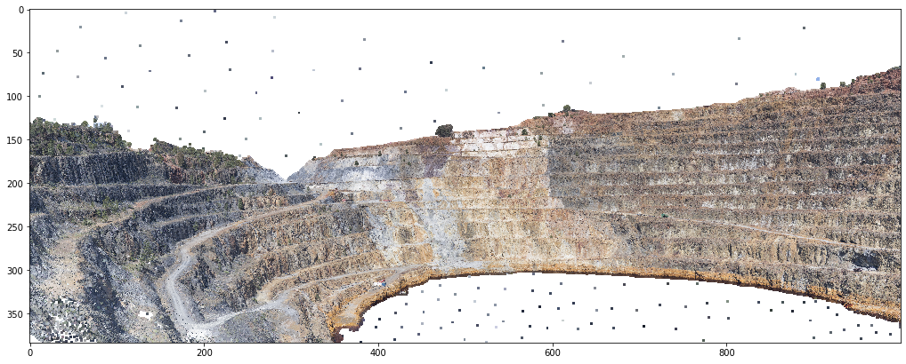
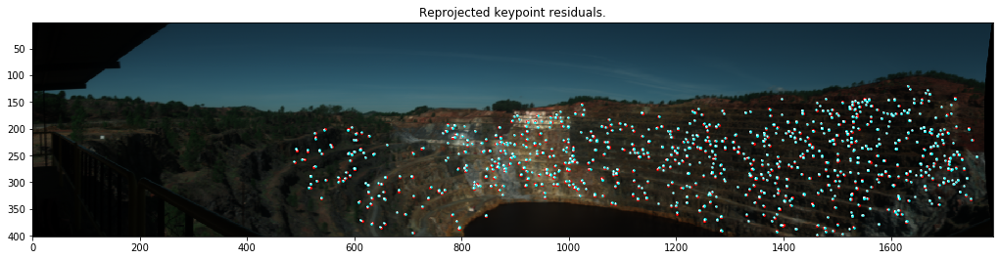

Pose estimation
===============

Estimate the position and orientation of a hyperspectral scanner using a
dense, georeferenced 3-D point cloud.

.. code:: python

    import os
    import glob
    import numpy as np
    from tqdm.auto import tqdm
    import utm
    import re

.. code:: python

    import hylite
    import hylite.io as io
    from hylite.sensors import Fenix
    from hylite.project.align import align_to_cloud
    from hylite.correct import estimate_sun_vec

Define data directories
-----------------------

.. code:: python

    # input directory containing images to locate (these should all be captured from about the same location)
    path = '/Users/thiele67/Documents/Data/SPAIN/2020_Sierra_Bullones/20200309_sun/Tharsis_smallpit_0068__3_3m00_4m00'
    image_paths = glob.glob( os.path.join(path,"*.hdr"), recursive=True )

.. code:: python

    # path to point cloud to georeference against
    cloud_path = '/Users/thiele67/Documents/Data/CA/CA_50cm_coregistered.ply'

.. code:: python

    print("Found %d images:" % len(image_paths))
    for p in image_paths:
        print(p)

.. parsed-literal::

    Found 1 images:
    /Users/thiele67/Documents/Data/CA/Terrestrial/2019/Corta_Atalaya__85_0m00_2m00_0079.hdr

Define initial camera estimate
------------------------------

.. code:: python

    pos = [
        
        np.array([711563.227,4175343.356,353.202]),
        # add more estimated positions as need be
        
    ]
    
    ori = [
        
        np.array([-89.907,-55.312,1.481]),
        # add more orientation estimates as need be
    ]
    
    assert len(ori) == len(pos) and len(pos) == len(image_paths), \
            "Error - position and orientation estimates must be specified for each image."
    
    cameras = []
    for i,p in enumerate(pos):
        cam = Fenix.get_camera()
        cam.pos = p # camera position
        cam.ori = ori[i] # camera orientation (as euler rotations)
        cameras.append(cam)

.. code:: python

    utm_zone = 29,'N' # utm zone - used to calculate sun vector (for topo correction)

Load point cloud and check initial camera estimate is reasonable
----------------------------------------------------------------

.. code:: python

    cloud = io.load( cloud_path )

.. code:: python

    n = 0 # index of image to generate preview for
    cameras[n].dims=(1000, cameras[n].dims[1]) # set preview render size
    fig,ax = cloud.quick_plot( cam=cameras[n] ) # render preview

Run computer magics ㋡
----------------------

.. code:: python

    recurse = 2 # repeate alignment twice to improve matching (set to 1 if initial locations are accurate).
    recalculate = False # recalculate images that have already been aligned. Otherwise existing camera data are used. 

.. code:: python

    for i,p in enumerate(tqdm(image_paths)):
    
        image = io.load( p ) #load image
        cam_est = image.header.get_camera() # look for stored camera
        
        if cam_est is None or recalculate: # image needs to be aligned
            print("\n\nAligning image %s" % p)
    
    
            cam = cameras[i]
            cam.dims = (image.xdim(), image.ydim()) # make sure camera dimensions exactly match image
    
            #estimate position
            cam_est, kp, e = align_to_cloud(image, cloud, cam, recurse=recurse)
    
            if cam_est is None:
                print("Error - failed to align camera %s")
                #continue # UNCOMMENT THIS LINE TO IGNORE NON-ALIGNED CAMERAS
                assert False, "Error - failed to align camera %s" % p 
        else: # image has already been aligned. Use this info instead. 
            print("\n\nUsing stored pose for %s" % p)
        
        #store camera location in image header
        image.header.set_camera(cam_est)
        
        #add utm zone and estimated sun vector to header
        image.header['utm Zone'] = "%d %s" % utm_zone
        lat,lon = utm.to_latlon( cam_est.pos[0], cam_est.pos[1], 
                                 utm_zone[0], utm_zone[1] )
    
        # UNCOMMENT THESE LINES TO FORCE TIME AND DATE
        #image.header['start time'] = 'UTC TIME: 11:15:00' # Time must be in UTC
        #image.header['acquisition date'] = 'DATE(yyyy-mm-dd): 2019-04-17'
        if 'start time' in image.header \
                and 'acquisition date' in image.header:
    
            #get time
            start = re.findall(r'\d{2}:\d{2}:\d{2}', image.header['start time'])[0]
            date = re.findall(r'\d{4}-\d{2}-\d{2}', image.header['acquisition date'])[0]
            time = ('%s %s' % (date, start), '%Y-%m-%d %H:%M:%S', 'UTC')
            sunvec, az, el = estimate_sun_vec( lat, lon, time)
    
            #store in header
            image.header['sun azimuth'] = '%d' % az
            image.header['sun elevation'] = '%d' % el
            
        #and save it
        outpath = io.matchHeader(p)[0]
        io.saveHeader(outpath, image.header)

.. parsed-literal::

    
    
    Aligning image /Users/thiele67/Documents/Data/CA/Terrestrial/2019/Corta_Atalaya__85_0m00_2m00_0079.hdr
    Projecting scene... Done.
    Gathering matches....r=258....g=298....b=275..(831).
    Solved PnP problem using 763 inliers (residual error = 1.0 px).
    ------------resolving using updated camera transform------------
    Projecting scene... Done.
    Gathering matches....r=429....g=461....b=437..(1327).
    Solved PnP problem using 1274 inliers (residual error = 1.1 px).

