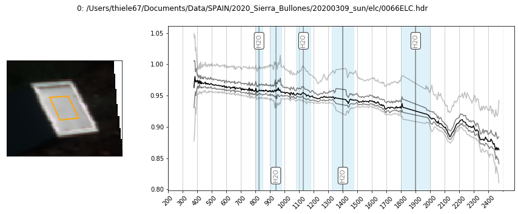

Identify calibration targets
============================

Attempt to automatically locate the calibration target in each scene. If
this fails for any images then the target can be located manually. Note
that the automated method only works for scenes containing a single
target!

Calibration spectra ( measured radiance vs known reflectance ) are then
extracted from the targets and stored in the image .hdr files.

.. code:: python

    import os
    import glob
    import numpy as np
    from tqdm.auto import tqdm
    
    import hylite
    import hylite.io as io
    from hylite.correct import Panel 

Define data directories
-----------------------

.. code:: python

    # input directory containing images to locate (these should all be captured from about the same location)
    path = '/Users/thiele67/Documents/Data/SPAIN/2020_Sierra_Bullones/20200309_sun/elc'
    image_paths = glob.glob( os.path.join(path,"*.hdr"), recursive=True )

.. code:: python

    print("Found %d images:" % len(image_paths))
    for p in image_paths:
        print(p)

.. parsed-literal::

    Found 1 images:
    /Users/thiele67/Documents/Data/SPAIN/2020_Sierra_Bullones/20200309_sun/elc/0066ELC.hdr

Define calibration panel material
---------------------------------

.. code:: python

    from hylite.reference.spectra import R90, R50, PVC_Red, PVC_White, PVC_Grey # load calibration material spectra
    M = R90 # define calibration panel material

Attempt to automatically identify targets
-----------------------------------------

.. code:: python

    for i,p in enumerate(tqdm(image_paths)):
        
        image = io.load( p ) #load image
        image.set_as_nan(0) # set nans 
        
        target = Panel(M,image,method='auto', bands=hylite.RGB) # look for panel
    
        #plot target
        fig,ax = target.quick_plot()
        fig.suptitle("%d: %s" % (i,p))
        fig.show()
    
        #add to header
        image.header.add_panel(target)
    
        #save
        outpath = io.matchHeader(p)[0]
        io.saveHeader(outpath, image.header)

If necessary, manually pick some targets
----------------------------------------

.. code:: python

    assert False, "Pause here and turn your brain on! ツ"

.. code:: python

    incorrect = [0,1,2,3] # choose incorrectly identified targets to manually select

First, clear incorrectly set targets from header file.

.. code:: python

    for i in incorrect:
        image = io.load( image_paths[i] )
        image.header.remove_panel(None) # remove panels
        outpath = io.matchHeader(image_paths[i])[0]
        io.saveHeader(outpath, image.header)

If targets do exist in scene, manually select them. Skip this step if no
targets exist.

.. code:: python

    targets = []
    for i in incorrect:
        
        image = io.load( image_paths[i] ) #load image
        target = Panel(M,image,method='manual',bands=hylite.RGB) # select panel
        
        #add to header
        image.header.add_panel(target)
    
        #save
        outpath = io.matchHeader(image_paths[i])[0]
        io.saveHeader(outpath, image.header)
        
        targets.append(target) # store for plotting

.. code:: python

    #plot targets
    %matplotlib inline
    for i,t in enumerate(targets):
        #plot target
        fig,ax = t.quick_plot()
        fig.suptitle("%d: %s" % (incorrect[i],image_paths[incorrect[i]]))
        fig.show()