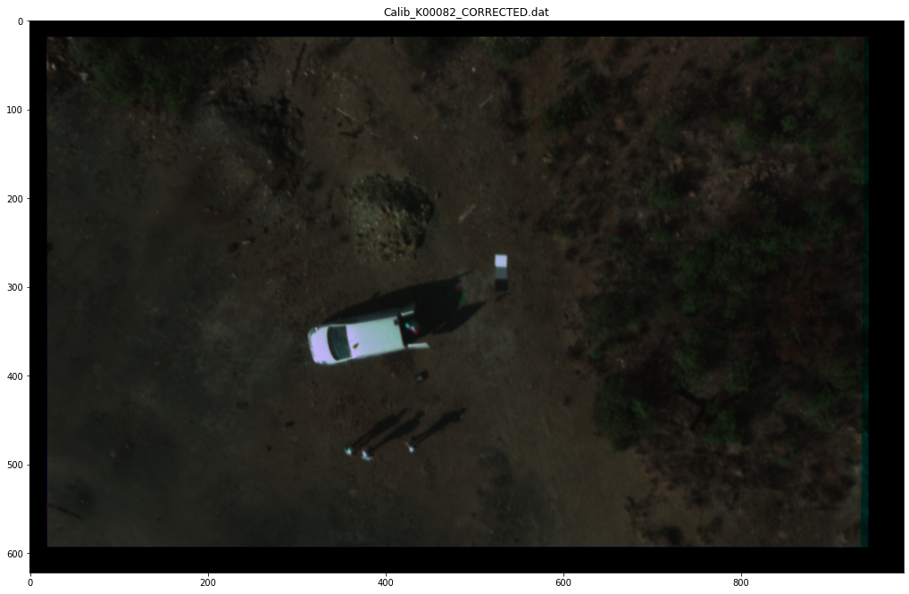
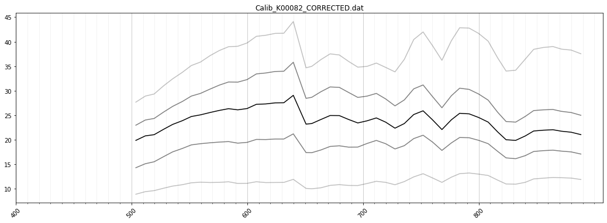

Internal sensor correction
================================

Load raw hyperspectral scenes and apply relevant sensor corrections. In
this case this is for the Rikola camera.

.. code:: python

    import os, glob
    import hylite

.. code:: python

    from hylite import io as io
    from hylite.sensors import Rikola # Import sensor used to capture data here

Select images to process
------------------------

1) Set path to “CalibData” folder containing radiance Rikola files and
   define list of images

.. code:: python

    path = "/net/fwghus/projects/fernerkundung/data/SPAIN/2016/Outcrops/Corta Atalaya/Sep_Oct_2016/Photogrammetry + Rikola UAV/flight-4-1/CalibData/"

Apply sensor corrections
------------------------

2 a) Correct each file in folder for lens distortion and align bands
with affine / deepflow matching workflow.

.. code:: python

    Rikola.correct_folder(path, 
                          multi=True, # Set True to activate multithreading
                          nthreads=4, # Set number of threads 
                          crop=False, # If you want to proceed to a hypercloud, set crop = False to maintain original size of image
                          overwrite=False) # Set True to overwrite previously corrected files

2 b) If you want to do some older folder reprocessing, where file
patterns may not fit and correct_folder fails, you can alternatively
correct the data file by file

.. code:: python

    os.chdir(path)
    outpath = "/net/fwghus/projects/fernerkundung/work/thiele67/Hylite Paper/Corte Atalaya/Hypercloud/input_RIKOLA/2016-1/"
    for file in glob.glob('*.dat'):
        image = io.loadWithGDAL(path + file)
        Rikola.correct_image(image, lens=True, align=True, crop=False)
        io.saveWithGDAL(outpath+file[:-4] + '_CORRECTED.dat', image)

Load example and plot preview
-----------------------------

.. code:: python

    # Load image
    paths = path + 'Calib_K00082_CORRECTED.dat'
    image = io.loadWithGDAL(paths)
    
    # Plot image
    fig,ax = image.quick_plot(hylite.RGB)
    ax.set_title(os.path.basename(paths))
    fig.show()
    
    #Plot spectra
    fig, ax = image.plot_spectra()
    ax.set_title(os.path.basename(paths))
    fig.show()

