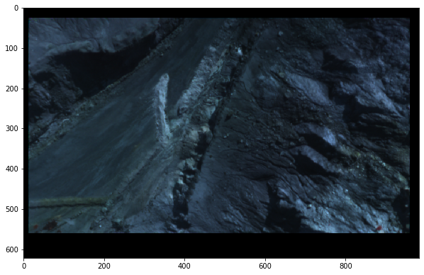
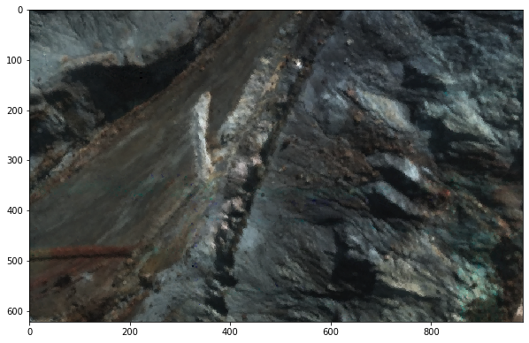
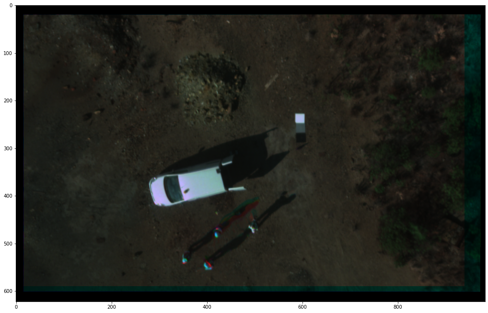
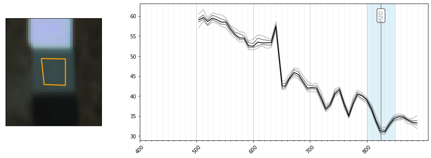

Estimate external parameters
============================

Extraction/calculation of all necessary parameters for projection and
correction of UAS frame-based HSI

.. code:: python

    import hylite
    import hylite.io as io
    from pathlib import Path
    import re, os, utm
    import numpy as np
    from hylite.correct import estimate_sun_vec
    from hylite.correct import Panel 
    from hylite.project import Camera
    from hylite.project.align import align_to_cloud
    from hylite.sensors import Rikola
    from tqdm import tqdm
    import scipy as sp
    from hylite.multiprocessing import parallel_datasets
    import matplotlib.pyplot as plt

Load list of and plot number of images. Be sure to have the TASKFILE.TXT
saved within the target folder.

.. code:: python

    flpth = "/Volumes/fernerkundung/data/SPAIN/2016/Outcrops/Corta Atalaya/Sep_Oct_2016/Photogrammetry + Rikola UAV/flight-4-1/CalibData/"
    images = sorted(list(Path(flpth).rglob("*_CORRECTED.hdr")) )
    print (len(images), "images found.")

.. parsed-literal::

    300 images found.

2.1 Pass metadata to header
===========================

Extract important information (time, date, location, altitude, UTM zone,
sunangle, initial camera parameters) from metadata file and save to
individual image headers.

.. code:: python

    for i, p in enumerate(tqdm(images)):
    
        head = io.loadHeader(io.matchHeader(p)[0])
        
        # Open taskfile
        with open(flpth + 'TASKFILE.TXT') as f:
            task = f.readlines()
        task = np.asarray(task[60:])
        tasklist = [task[i].split(",") for i in range(len(task))]
        length = max(map(len, tasklist))
        taskfile = np.array([i+[None]*(length-len(i)) for i in tasklist])    
        rawfilename = os.path.split(p)[1].replace('_CORRECTED.hdr', '.DAT')[6:]
        filenumber = np.where(taskfile[:, 0] == rawfilename)
        
        if taskfile[filenumber,7][0][0] == ' NoGPRMC':
           
            # DEFINE FIXED POSITION AND TIME/DATE HERE IF GPS IS NOT AVAILABLE:
            lat = -26.467900
            long = 16.023124
            alt = 1013.
            time = '14:40:00'
            date = '14.7.2019'
            print("No GPS data acquired for image ", str(filenumber), '. Define manual constant values for position, time and date, \
            otherwise nonsense might occur. Your current settings are:', str(lat),',', str(long), ",", str(alt), 'm ,', date, time)
    
        else:    
            # Get position
            lat_init = float(taskfile[filenumber, 9][0][0]) / 100
            long_init = float(taskfile[filenumber, 11][0][0]) / 100
            alt = float(taskfile[filenumber, 16][0][0])
            lat = (int(lat_init)) + (int(100*(lat_init-int(lat_init))))/60. + (100*(lat_init-int(lat_init))\
                                                                - int(100*(lat_init-int(lat_init))))/60.0
            long = (int(long_init)) + (int(100*(long_init-int(long_init))))/60. + (100*(long_init-int(long_init))\
                                                                 - int(100*(long_init-int(long_init))))/60.0
            if 'S' in str(taskfile[filenumber, 10]):
                lat *= -1
            if 'W' in str(taskfile[filenumber, 12]):
                long *= -1
            
            # Fetch time and date
            test = taskfile[filenumber, 8].tolist()
            times = str(int(float('[]'.join(test[0]))))
            time = times[:2] + ':' + times[2:4] + ':' + times[4:]
            test = taskfile[filenumber, 6].tolist()
            date = ('[]'.join(test[0])).split(' ')[1]
    
    
        # Convert to UTM    
        X, Y, UTM_num, UTM_let = utm.from_latlon(lat, long)
        if UTM_let.upper() > "M":
            head['utm Zone'] = "%d %s" % (UTM_num, 'N')
        else:
            head['utm Zone'] = "%d %s" % (UTM_num, 'S')
    
        
        # UNCOMMENT THE FOLLOWING TWO LINES TO FORCE TIME AND DATE 
        #date = '26.08.2016' # Date in format 'dd.mm.yyyy'
        #time = '15:17:23' # Time must be in UTC: 'hh:mm:ss'
    
        head['start time'] = time
        head['acquisition date'] = date 
        time = ('%s %s' % (head['acquisition date'], head['start time']), '%d.%m.%Y %H:%M:%S', 'UTC')
        
        # Calculate sun angle
        sunvec, az, el = estimate_sun_vec(lat, long, time)
        head['sun azimuth'] = '%d' % az
        head['sun elevation'] = '%d' % el
        
        # Estimate initial camera
        cam_init = Camera(pos=np.array([X, Y, alt]), ori=np.array([0., 0, 270]), proj='persp', 
                     fov = 36.5/1010 * int(head['lines']),
                     step = 0.036,
                     dims = (int(head['samples']), int(head['lines'])))
        head.set_camera(cam_init)
        head['camera status'] = 'init'
        
        # Save metadata to header
        outpath = io.matchHeader(p)[0]
        io.saveHeader(outpath, head)

2.2 Estimate camera parameters
==============================

a) use external software (Agisoft Metashape)
--------------------------------------------

1) Export each image as geotagged RGB JPEGs. Be sure to have the
   TASKFILE.TXT saved within the target folder

.. code:: python

    Rikola.GPS_JPG(flpth)

2) From the exported JPEGs, align valid images with Metashape, either
   (1) in a stand-alone project, or (2) process as Rikola JPEGs as
   separate chunks of an existing project and align the chunk with the
   existing pointcloud.

IMPORTANT:

-  Convert your reference image coordinates and set project EPSG to UTM
   BEFORE alignment! (“Convert” in the reference toolbar)
-  Set camera calibration BEFORE alignment to pixelsize=0.0055 x 0.0055
   mm, focal length = (ydim0.0055)/(2tan(36.5/(21010)ydim)) (should be
   something around 8.6 in most cases), f=1580, fix ALL camera
   parameters
-  Align Rikola JPEGS in separate Chunk, then “Align Chunks” with
   RGB-JPEGs as reference, afterwards “Merge Chunks”
-  Calculate and export densecloud from Rikola JPEGs
-  Export final camera pos and ori as .txt by Export -> Cameras ->
   Omega, Phi, Kappa

3) continue with 2.2b) to load the exported camera parameters into a
   camera object.

b) set from list of known position and orientation
--------------------------------------------------

1) Load list of cameras from external file

.. code:: python

    pospath = '/net/fwghus/projects/fernerkundung/data/SPAIN/2016/Outcrops/Corta Atalaya/Sep_Oct_2016/Photogrammetry + Rikola UAV/Hypercloud_202007/Rikola_aligned_cam.txt'
    cam_name = np.genfromtxt(pospath, delimiter='\t', skip_header=2, usecols=(0), dtype="str") # Load camera name
    camera_pos = np.genfromtxt(pospath, delimiter='\t', skip_header=2, usecols=(1,2,3)) # Load x, y, z
    camera_ori = np.genfromtxt(pospath, delimiter='\t', skip_header=2, usecols=(4,5,6)) # Load pitch, roll, yaw 

2) Set up external camera parameters and save to image header

.. code:: python

    def load_cam(p, p2):
    
        # load image header
        head = io.loadHeader(io.matchHeader(p)[0])
    
        # find correct cam params according to file name
        cam_num = np.where(cam_name == "flight-4-2_" + (Path(p).stem))[0]  
        if cam_num.size > 0:
            ori = camera_ori[cam_num, :][0]
            pos = camera_pos[cam_num, :][0]
    
            cam = Camera(pos, camera_ori[cam_num, :][0]*-1,
                         proj = 'persp', 
                         fov = 36.5/1010 * int(head['lines']),
                         step = 0.036,
                         dims = (int(head['samples']), int(head['lines'])))
            head.set_camera(cam)
            head['camera status'] = 'external'
    
            # save metadata to header
            outpath = io.matchHeader(p)[0]
            io.saveHeader(outpath, head)
            print("External camera info added for " + p.stem)
        else:
            print("No matching image name found for " + p.stem)
     

.. code:: python

    parallel_datasets(load_cam, images, nthreads=4)

c) calculate by alignment to existing cloud
-------------------------------------------

1) Load available RGB point cloud

.. code:: python

    pth = '/net/fwghus/projects/fernerkundung/data/SPAIN/2016/Outcrops/Corta Atalaya/Sep_Oct_2016/Photogrammetry + Rikola UAV/Hypercloud_202007/Rikola_SfM_2020_cloud_aligned.ply'
    cloud = io.loadCloudPLY(pth)

2) Align each scene to cloud - Be sure that initial camera properties
   are available from header by either loading camera metadata (2.1) or
   adding external camera estimates (2.2 a)

.. code:: python

    def align_images_to_cloud(p, p2):    
        
        # Load image and read inital camera from header
        image = io.loadWithGDAL(p)
        cam_init = image.header.get_camera()
        if cam_init is not None:
            if image.header['camera status'] != 'optimized': 
                image.data[image.data == 0] = np.nan
    
                # Align image to cloud and save estimated camera to header
                cam_est, kp, e = align_to_cloud(image, cloud, cam_init,  bands=(9,5,0), s=2, sf=1, recurse=2, gf=True)
                if cam_est is not None:
                    image.header.set_camera(cam_est)
                    image.header['camera status'] = 'optimized'
                    # Save updated header to disk
                    outpath = io.matchHeader(p)[0]
                    io.saveHeader(outpath, image.header)
                    print(p.stem + " successfully aligned.")
                else: 
                    print(p.stem + " could not be aligned.")
            else: 
                print(p.stem + " is already aligned and is skipped.")
    
        else:
            print(p.stem + " has no camera info and is skipped.")

.. code:: python

    parallel_datasets(align_images_to_cloud, images, nthreads=30)

3) Check how many images failed to align, create a list of uncorrected
   images and rerun the alignment if required

.. code:: python

    rerun =[]
    for i, p in enumerate(images):
        head = io.loadHeader(io.matchHeader(p)[0])
        print (str(i) + '  ' + head['camera status'] + '   -  ' + p.stem)
        if head['camera status']=='external':
            rerun.append(p)
    print (len(rerun), "images were not aligned. Consider re-running alignment for selected images (list 'rerun')"

.. code:: python

    parallel_datasets(align_images_to_cloud, rerun, nthreads=9)

2.2 Plot and check if cameras are well-aligned
==============================================

Compare image and estimated camera view - check carefully for any
offsets! :)

.. code:: python

    # Load cloud if not yet done
    pth = '/net/fwghus/projects/fernerkundung/data/SPAIN/2016/Outcrops/Corta Atalaya/Sep_Oct_2016/Photogrammetry + Rikola UAV/Hypercloud_202007/Rikola_SfM_2020_cloud_aligned.ply'
    cloud = io.loadCloudPLY(pth)

.. code:: python

    # Load image
    i = 171
    image = io.loadWithGDAL(images[i]) 
    print("Loaded image " + str(images[i].stem) + " with %d samples (x), %d lines (y) and %d bands." % (image.samples(), image.lines(), image.band_count()))
    
    # Plot it
    fig, ax = plt.subplots(figsize=(10, 10))
    fig, ax = image.quick_plot(band=(45, 20, 10), ax=ax)

.. parsed-literal::

    Loaded image Calib_K00412_CORRECTED with 983 samples (x), 622 lines (y) and 50 bands.

.. code:: python

    # Plot estimated camera view
    ortho = cloud.render(image.header.get_camera(), 
                         fill_holes=True, 
                         blur=True,
                         s=2, 
                         bands='rgb')
    fig,ax = plt.subplots(figsize=(10, 10))
    fig,ax = ortho.quick_plot(band=(0, 1, 2), ax=ax)

2.3 Extract reference targets
=============================

Select hyperspectral image containing reference targets. The image is
optimally taken spatially and timely close to the rest of the
acquisition and at a similar altitude:

.. code:: python

    ref_path = 'Calib_K00074_CORRECTED.hdr'
    ref_image = io.loadWithGDAL(flpth + ref_path) # Load image
    ref_image.quick_plot(band=hylite.RGB)

.. parsed-literal::

    (<Figure size 1296x820.053 with 1 Axes>, <AxesSubplot:>)

Define calibration panel material:

.. code:: python

    from hylite.reference.spectra import R90, R50, PVC_Red, PVC_White, PVC_Grey, PVC_Black # Load calibration material spectra
    M = [PVC_Grey, PVC_Black] # Define calibration panel material

Manually select targets from image

.. code:: python

    targets = []
    for i, m in enumerate(M):
        target = Panel(m, ref_image, method='manual', bands=hylite.RGB) # Select panel, change method to "sobel" for auto detection
        targets.append(target) # Store

Plot targets

.. code:: python

    %matplotlib inline
    for i, t in enumerate(targets):
        fig,ax = t.quick_plot()
        fig.show()

.. image:: output_38_1.png

Save reference information to header

.. code:: python

    for i, p in enumerate(tqdm(images)):
    
        # Load image header
        head = io.loadHeader(io.matchHeader(p)[0])
    
        # Add to header
        for j, t in enumerate(targets):
            head.add_panel(t)
    
        # Save to disk
        outpath = io.matchHeader(p)[0]
        io.saveHeader(outpath, head)

